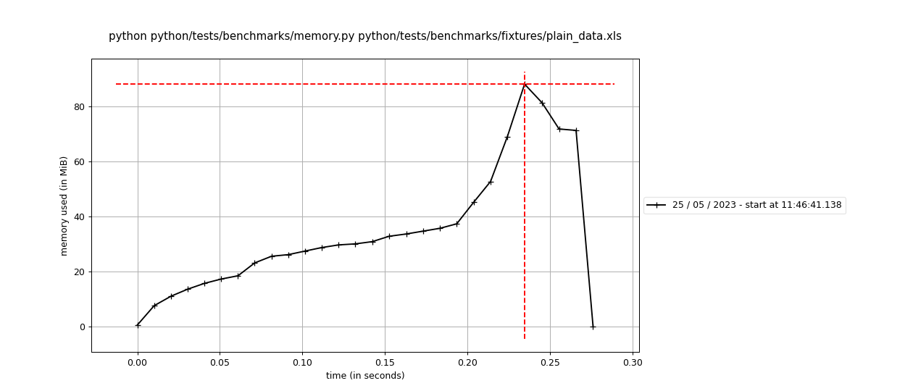
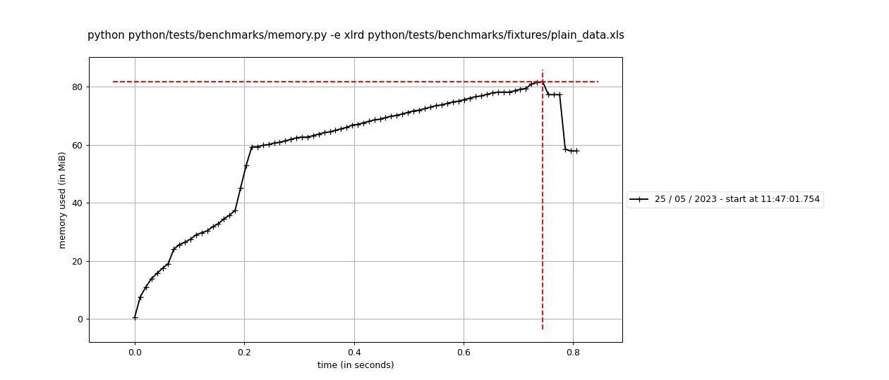
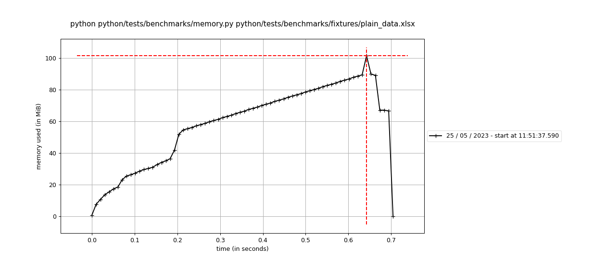
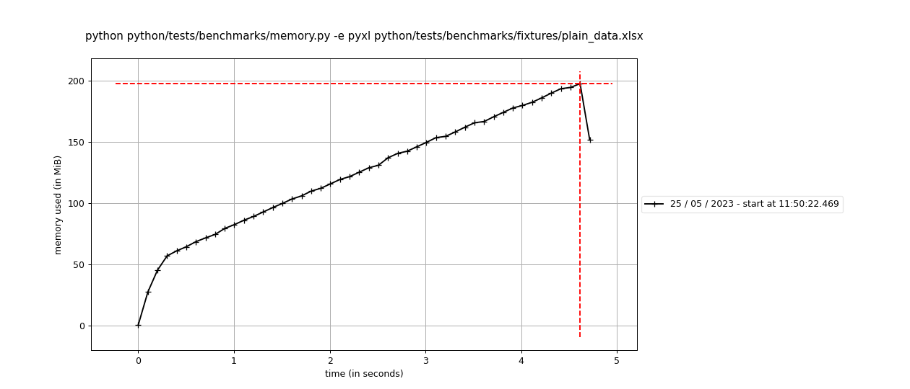
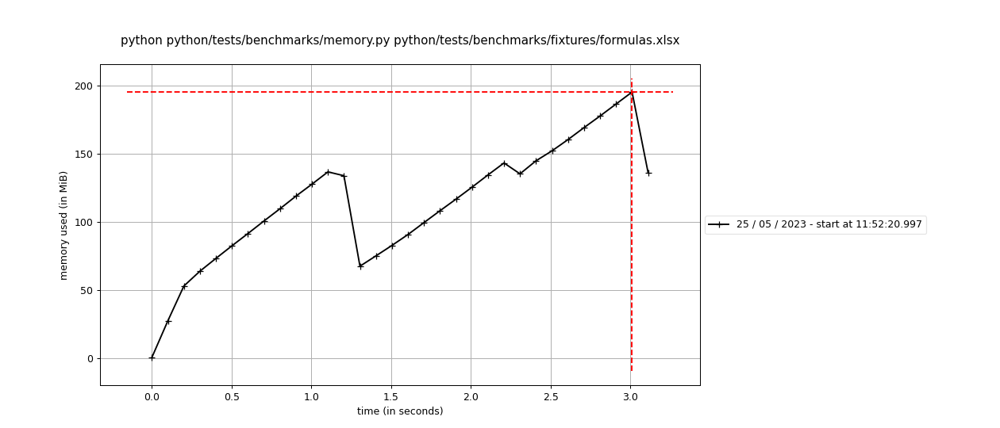
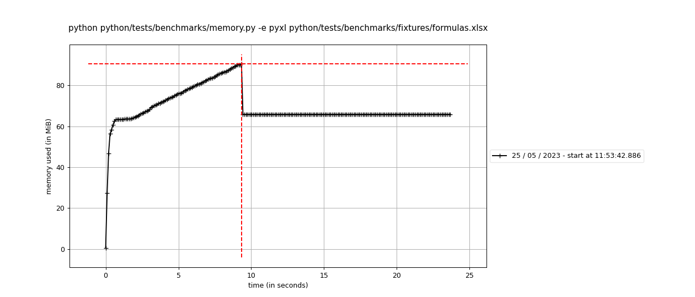

# Benchmarks

These benchmarks were generated using `pytest-benchmark`.

> **_NOTE:_**  formulas.xlsx was found [here](https://foss.heptapod.net/openpyxl/openpyxl/-/issues/494) plain_data.xls and plain_data.xlsx can be found [here](https://public.opendatasoft.com/explore/dataset/covid-19-pandemic-worldwide-data/export/?disjunctive.zone&disjunctive.category)

Using the following command:

```bash
make benchmarks
```

The results are from my local machine. This is not 100% accurate.

## Speed
### 'xls': 2 tests
|Name (time in ms)|Min|Max|Mean|StdDev|Median|IQR|Outliers|OPS|Rounds|Iterations|
|-----------------|---|---|----|------|------|---|-------|---|-------|----------|
|test_fastexcel_xls|27.0991 (1.0)|33.7495 (1.0)|29.5819 (1.0)|1.6429 (1.0)|29.3559 (1.0)|2.7158 (1.0)|10;0|33.8044 (1.0)|29|1|
|test_xlrd|596.5040 (22.01)|628.7964 (18.63)|612.5730 (20.71)|12.9967 (7.91)|615.1620 (20.96)|20.7911 (7.66)|2;0|1.6325 (0.05)|5|1|


### 'xlsx': 4 tests
|Name (time in ms)|Min|Max|Mean|StdDev|Median|IQR|Outliers|OPS|Rounds  Iterations|
|-----------------|---|---|----|------|------|---|--------|---|------------------|
|test_fastexcel_xlsx|437.5810 (1.0)|470.7615 (1.0)|457.9611 (1.0)|13.7401 (1.0)|457.7006 (1.0)|21.0743 (1.25)|1;0|2.1836 (1.0)|5|1|
|test_fastexcel_with_formulas|3,106.7454 (7.10)|3,150.2050 (6.69)|3,122.5234 (6.82)|16.6031 (1.21)|3,120.9000 (6.82)|16.8614 (1.0)|1;0  0.3203 (0.15)|5|1|
|test_pyxl|4,780.2341 (10.92)|4,998.7753 (10.62)|4,899.6885 (10.70)|110.4665 (8.04)|4,948.7550 (10.81)|211.6149 (12.55)|2;0|0.2041 (0.09)|5|1|
test_pyxl_with_formulas|25,312.8494 (57.85)|26,621.4687 (56.55)|25,808.5418 (56.36)|545.0540 (39.67)|25,748.0901 (56.26)|852.3171 (50.55)|1;0|0.0387 (0.02)|5|1|


## Memory usage

| fastexcel memory usage | other memory usage |
|-|-|
| ||
| ||
| ||
